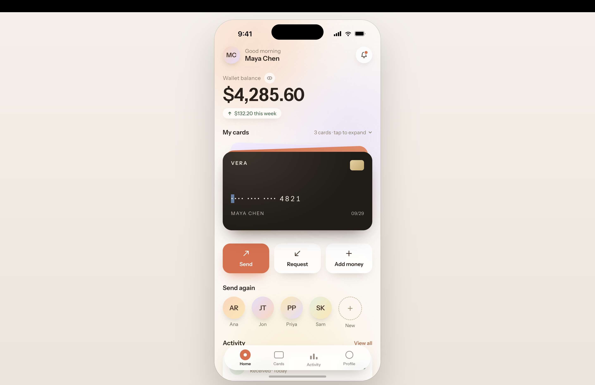
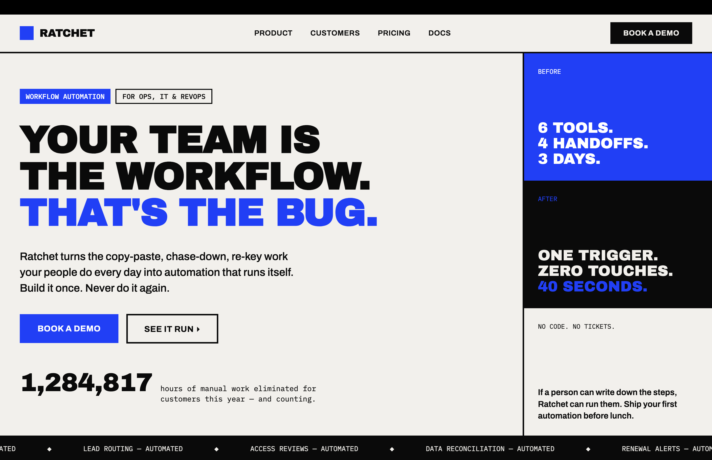
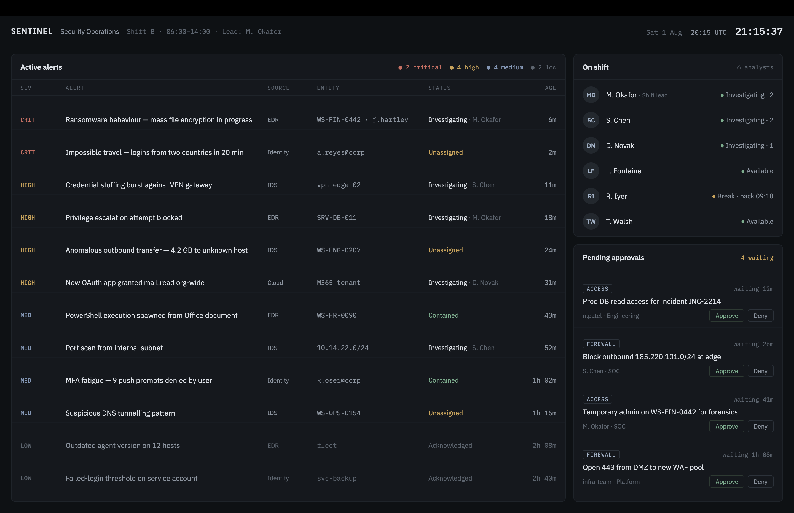

# mobile-web-design

A Claude Skill for UI/UX design work on mobile apps, web apps, and desktop dashboards. It combines:

- **Universal UX psychology** — Hick's Law, Fitts's Law, cognitive load, Gestalt principles, visual hierarchy, progressive disclosure, and colour-as-meaning — applied consistently regardless of visual style.
- **Platform adaptation** — explicit guidance on how layout, interaction, and information density should differ between mobile and desktop/web, rather than treating one as a scaled-down version of the other.
- **Five distinct visual styles**, each fully specified with colour tokens, depth/shadow rules, shape language, typography, spacing, style-specific psychology, and mobile + desktop adaptation notes:
  - **Ambient Gradient** — soft gradient mesh, glow-based depth, rounded everything. Fits premium fintech, AI-forward products, onboarding flows.
  - **Moody Editorial** — dark base, photography-led, minimal chrome. Fits wellness, meditation, lifestyle/content apps.
  - **Soft Minimal Dashboard** — light neutral base, colour reserved for status/data, soft shadow elevation. Fits internal tools, ops/security dashboards.
  - **Bold Flat Blocks** — solid saturated colour blocks, zero depth, high contrast. Fits B2B/enterprise wanting a confident, differentiated brand voice.
  - **Modern SaaS Light** — white base, gradient accents in data viz only, pill shapes. Fits consumer/prosumer SaaS and general-purpose dashboards.
- **A style selector** in `SKILL.md` that routes a design brief to the right style automatically based on language and product category — no need to name the style explicitly, though you still can.

The five styles were derived by analysing patterns (colour, shape, depth, type, spacing) observed across real product UI, not by copying or reproducing any specific screenshots or brand assets.

## Examples

Every example below was generated *by the skill*, from a natural-language brief with no style name mentioned — not hand-designed to match. This is what the style routing actually produces in practice.

### Ambient Gradient — premium fintech / wallet app
> *"I'm designing a digital wallet app for mobile... I want the home screen to feel premium and trustworthy, not cold or sterile like a typical banking app."*



### Bold Flat Blocks — confident B2B SaaS
> *"Design the homepage hero section for a B2B software company's marketing website... The brand wants to feel confident and direct — no soft gradients or corporate blandness."*



### Soft Minimal Dashboard — security operations console
> *"Design a web-based operations dashboard for a security team monitoring active alerts, agent status, and pending approvals... needs to stay legible and calm under a lot of information."*



**Note:** this output is dark-mode and console-styled, which diverges from the light-canvas spec currently written in `soft-minimal-dashboard.md`. The result is still strong, cohesive design — it just suggests the reference may be worth revising to explicitly cover a dark ops-console variant rather than assuming light-only. Flagging for transparency rather than presenting it as a perfect match to the current written spec.

### Moody Editorial — wellness / meditation
*Example coming soon.*

### Modern SaaS Light — consumer analytics dashboard
*Example coming soon.*

## Install

```
/plugin marketplace add jahitjanberk/mobile-web-design-skill
/plugin install mobile-web-design@jahit-design-tools
```

Or in claude.ai: **Settings → Customize → Skills → "+" → "+ Create skill"**, and upload this repo as a `.zip`.

## Structure

```
mobile-web-design-skill/
├── .claude-plugin/
│   └── marketplace.json
├── plugins/
│   └── mobile-web-design/
│       ├── .claude-plugin/
│       │   └── plugin.json
│       └── skills/
│           └── mobile-web-design/
│               ├── SKILL.md
│               └── references/
│                   ├── ambient-gradient.md
│                   ├── moody-editorial.md
│                   ├── soft-minimal-dashboard.md
│                   ├── bold-flat-blocks.md
│                   └── modern-saas-light.md
├── screenshots/
│   ├── ambient-gradient-wallet-app.png
│   ├── bold-flat-blocks-ratchet-landing.png
│   └── soc-dashboard-sentinel.png
└── README.md
```

## License

MIT
